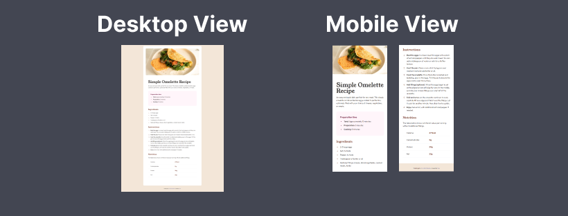

# Frontend Mentor - Recipe page solution

This is a solution to the [Recipe page challenge on Frontend Mentor](https://www.frontendmentor.io/challenges/recipe-page-KiTsR8QQKm). Frontend Mentor challenges help me improve my coding skills by building realistic projects. 

## Table of contents

- [Overview](#overview)
  - [The challenge](#the-challenge)
  - [Screenshot](#screenshot)
  - [Links](#links)
- [My process](#my-process)
  - [Built with](#built-with)
  - [What I learned](#what-i-learned)
- [Author](#author)
## Overview

### Screenshot



### Links

- Solution URL: [Add solution URL here](https://your-solution-url.com)
- Live Site URL: [Add live site URL here](https://your-live-site-url.com)

## My process

### Built with

- Semantic HTML5 markup
- Mobile-first workflow
- [TailwindCSS](https://tailwindcss.com/) - CSS library

### What I learned

It's my first time using tailwindCSS using CDN, and discover some tips in tailwindCSS doing this challenge.
Honestly, with my knowledge at this moment, I can say that this challenge is very easy. It's just a simple integration of only one page, I did it just around 15 minutes. But I have learned some things:

- styling the counters or bullets in lists using the `marker` modifier:

```css
ul {
    @apply list-disc list-outside ms-6 marker:text-nutmeg;
}
ol {
    @apply list-decimal list-outside ms-6 marker:text-nutmeg;
}
```

- extend colors of tailwindCSS with costum colors:

```javascript
tailwind.config = {
  theme: {
    extend: {
      colors: {
        nutmeg: 'hsl(14 45% 36%)',
        "dark-raspberry": 'hsl(332 51% 32%)',
        "rose-white": 'hsl(330, 100%, 98%)',
        eggshell: 'hsl(30, 54%, 90%)',
        "light-grey": 'hsl(30, 18%, 87%)',
        "wenge-brown": 'hsl(30, 10%, 34%)',
        "dark-charcoal": 'hsl(24, 5%, 18%)',
      }
    }
  }
}
```

## Author

- Frontend Mentor - [@tokiniaina](https://www.frontendmentor.io/profile/Toukoms)
